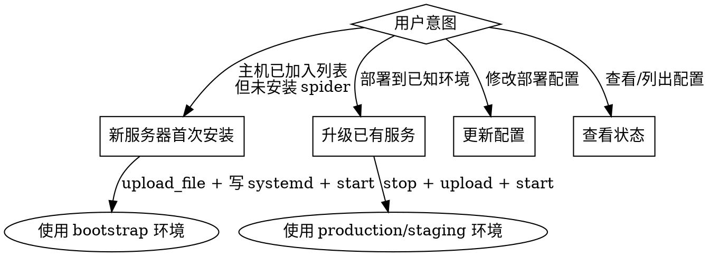

# Spider 自动化部署

## 概述

通过 `.spider/deploy.yaml` 配置文件和 spider MCP 工具，实现"一句话部署"。
Claude 负责本地构建和配置管理，spider 负责 SSH 操作（上传、执行命令）。

## 安装路径选择

| 场景 | 使用环境 | 说明 |
|------|---------|------|
| 新服务器首次安装 | `bootstrap` | 无需目标服务器有任何服务，通过 `upload_file` 直接 SCP |
| 已有服务升级 | `production` / `staging` | 先 stop 再上传再 start |
| 已有 spider 实例，新服务器自助安装 | — | 目标服务器运行 `curl .../server-install.sh \| sh` |

**首次安装必须用 `bootstrap` 环境**，`production` 的 `pre_deploy` 会 stop 服务，新机器上服务不存在时虽然加了 `|| true` 不会中止，但语义上 `bootstrap` 更清晰。

## 操作决策



---

## 操作一：首次部署（推断 + 创建配置）

**触发条件：** `.spider/deploy.yaml` 不存在，或用户要求配置新环境。

**步骤：**

| 步骤 | 操作 | 说明 |
|------|------|------|
| 1 | 检查 `Makefile` | 查找 `build`、`all` 等 target，确定 `build_cmd` |
| 2 | 检查 `dist/` 或 `bin/` | 确定本地产物路径（`artifacts.local`） |
| 3 | 调用 `list_hosts` | 展示可用主机，让用户选择目标 |
| 4 | 询问远程路径 | `artifacts.remote`，如 `/usr/local/bin/spider` |
| 5 | 推断 pre/post 命令 | 根据产物类型建议（二进制 → systemctl，静态文件 → nginx reload） |
| 6 | **展示完整配置，等待确认** | 用户确认后再写入文件 |
| 7 | 写入 `.spider/deploy.yaml` | 追加新环境到 `deployments` 节点 |
| 8 | 执行部署 | 按"操作二"流程执行 |

**关键规则：** 步骤 6 必须等用户确认，不得跳过。

---

## 操作二：执行部署

**触发条件：** 用户说"部署到 X"，且 `.spider/deploy.yaml` 中存在对应环境。

**步骤：**

```
1. 读取 .spider/deploy.yaml → 找到目标环境配置
2. [有 build_cmd？] → 本地执行；失败则报错中止，不继续
3. list_hosts(tag=...) + 按 name 查询 → 合并去重得到主机列表
4. 对每台主机【并行】执行：
   a. execute_command(pre_deploy 命令，顺序执行)
   b. upload_file(local_path, remote_path)
   c. [有 mode？] execute_command("chmod {mode} {remote_path}")
   d. execute_command(post_deploy 命令，顺序执行)
5. 汇总结果：成功 N 台 / 失败 N 台，失败的列出错误
```

**MCP 工具参数速查：**

| 工具 | 关键参数 | 用途 |
|------|---------|------|
| `list_hosts` | `tag` | 按标签查询主机列表 |
| `execute_command` | `host_id`, `command` | 执行单条命令，自动记录审计日志 |
| `upload_file` | `host_id`, `local_path`, `remote_path` | SCP 上传，5 分钟超时 |

---

## 操作三：更新部署配置

**触发条件：** 用户要修改已有环境的配置（换主机、改路径、改命令等）。

**步骤：**
1. 读取当前 `.spider/deploy.yaml`，展示目标环境现有配置
2. 根据用户描述修改对应字段
3. 展示 diff，等待确认
4. 写入文件

---

## 操作四：查看部署配置

**触发条件：** 用户问"有哪些部署配置"、"production 怎么配置的"。

直接读取并展示 `.spider/deploy.yaml` 相关内容。

---

## 安全规则

- **build_cmd 失败必须中止**，不得继续上传
- **首次创建配置必须用户确认**，不得静默写入
- **单台主机失败不影响其他台**，继续并行执行
- **不在配置文件中存储凭据**（密码、私钥）
- **local_path 必须是相对项目根目录的路径**，执行前验证文件存在
- 所有 SSH 操作自动记录在 spider 审计日志，无需额外处理

---

## .spider/deploy.yaml 格式参考

```yaml
deployments:
  production:
    build_cmd: "make build"          # 可选
    target:
      tag: prod                      # 按标签（与 name 可共存）
      # name: prod-01                # 或按主机名
    parallel: true
    artifacts:
      - local: ./dist/spider
        remote: /usr/local/bin/spider
        mode: "0755"                 # 可选
    pre_deploy:
      - "systemctl stop spider"
    post_deploy:
      - "systemctl start spider"
      - "systemctl status spider"
```
